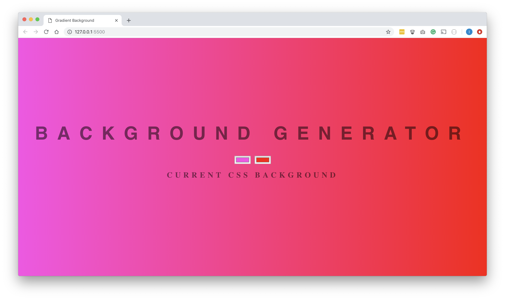
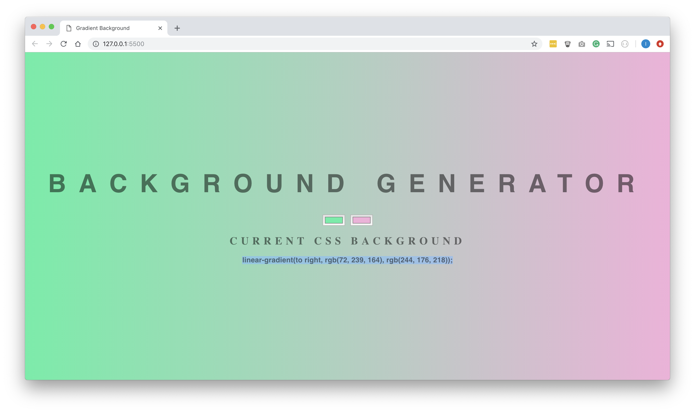

## Description
Background gradient generator using html, css and Javascript. It allows you to input two background colours and will return the css code for that exact background.

## Screenshots

When two new colour are selected the css code is diplayed below (as highlighted in the below screenshot):
